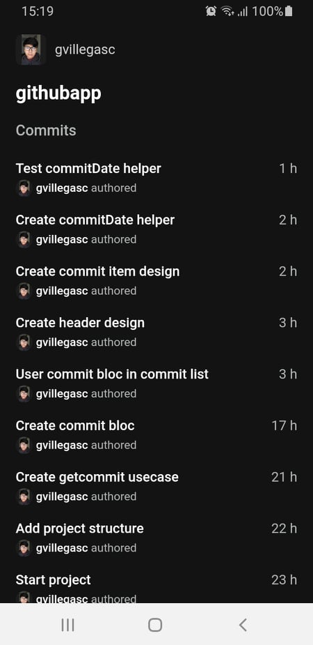
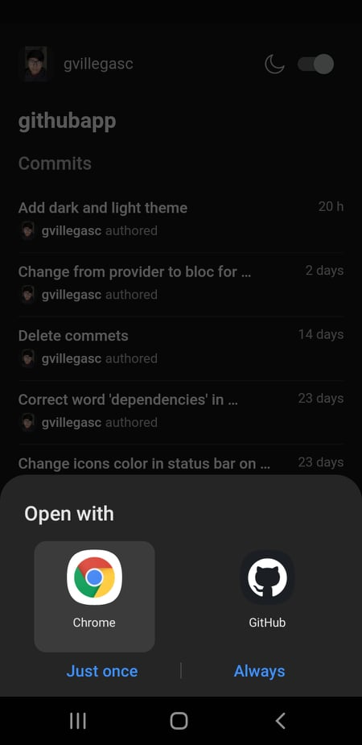

# Githubapp

Githubapp is a mobile application for a technical test on flutter.

## Getting Started

### Pre-requisites

For run this application you must install [Flutter](https://flutter.dev/) 2.0 or higher.

You can know how to install flutter [here](https://flutter.dev/docs/get-started/install)

### Installation

Clone the project and next use the command line `flutter` to download the app dependencies

```bash
# clone the repository
git clone https://github.com/gvillegasc/githubapp.git

# move to the cloned repository
cd githupapp

# get dependencies
flutter pub get
```

### Usage

To execute the project you have to have an android cell phone or ios emulator and execute the following command.

```bash
flutter run
```

### App images

<table>
    <tr>
        <th>Commit Page</th>
        <th>See changes</th>
    </tr>
	<tr>
        <td></td>
        <td></td>
	</tr>
</table>

### Run test

to run the unit tests you must run the following command remember that to run the tests is necessary to install the dependencies

```bash
flutter test
```

## Builded with

- [Flutter](https://flutter.dev/) - SDK for develop

## Author

- **Gerardo Villegas** - [gvillegasc](https://github.com/gvillegasc)
